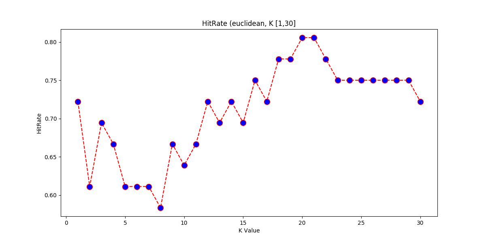
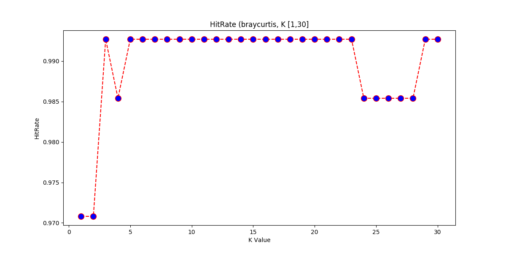

# Homework 01 - Machine learning a.a. 2018/19

## Librerie utilizzate

Le librerie utilizzate sono:

* **pandas**: caricamento e manipolazione del **DataSet**
* **sklearn**: algoritmi, statistiche e suddivisione del **TrainingSet**

> **nota**: *Per completezza di implementazione, nella cartella è presente una versione dello stesso script senza l'uso di librerie esterne (`main-from-scratch.py` + `lib.py`).
> Utile per capire l'implementazione degli algoritmi.*


## Script usage

```bash
main.py [dataset] [test_size]
```

* **dataset**: [wine|breast-cancer|letters|poker] - select DataSet. Default is *wine*
* **testset_size**: [0,1] - TestSet dimension


## Script steps

1. Caricamento **DataSet** (CSV)
   
    ```dataset = pd.read_csv(ts_selected_opts['url'], names=ts_selected_opts['columns'])```
   
   Viene caricato il *DataSet* da file *.csv* ed indicati i nomi descrittivi del vettore di **input**.
   
2. Manipolazione del **DataSet**

   * Cancellazione delle righe "non conformi"
   
        ```dataset = dataset[~(dataset.astype(str) == '?').any(1)]```
        
        Vengono eliminate le righe contenenti '**?**'.
   
   * Selezione dell'**input** e dell'**output**
   
        ```python
        X = dataset.iloc[ts_selected_opts['x_slice'][0], ts_selected_opts['x_slice'][1]]
        y = dataset.iloc[ts_selected_opts['y_slice'][0], ts_selected_opts['y_slice'][1]]
        ```
        
        Attraverso lo slice della matrice separo le colonne dell'output da quelle dell'input, e per quest'ultime elimino quelle 
        non significative e fuorvianti (eg. *identification* nel *breast-cancer*).
        
        In questo caso lo slice cambia a seconda del **DataSet** scelto (*wine* o *breast-cancer*)
      
   * Casting dei dati
   
        Automaticamente effettuato da *sklearn*
     
3. Suddivisione randomica in **TrainingSet** e **TestSet**

    ```X_train, X_test, y_train, y_test = train_test_split(X.values, y.values, test_size=test_size))```
  
    Suddivido casualmente il **DataSet** in:
    
    * **(1-test_size)** TrainingSet: X_train + y_train
    * **test_size** TestSet: X_test + y_test
    
    Se non specificato *test_size=0.20*
   
4. Applico il **Knn** su diverse **k** e **metriche**

    ```python
     for metric in metrics:
    
            print('\nRunning KNN for ' + metric)
            hit_rate = []
    
            # Calculating error for K values between 1 and 40
            for k in range(1, k_max):
                current_hit_rate = knn(X_train, y_train, X_test, y_test, k, metric)
    
                print('Accuracy for k={0:>2}: {1:.4f}'.format(k, current_hit_rate))
                hit_rate.append(current_hit_rate)
    
            # ... Graph plot ...
    ```
    
    Applico per ogni **metrica** scelta: *euclidean, manhattan, chebyshev, minkowski, hamming, canberra, braycurtis*
    
    * **k** che va da 1 a 30.
    * Calcolo l'**hitrate** (o accuratezza)
    * Visualizzo su grafico il suo andamento al variare di **k**
    
4. Come al punto *4*, ma per il **Proximity Weighted Algo** su diverse **metriche** (ovviamente senza *k*)
    

## Risultati

### Informazioni sui dati

I risultati riportati sotto sono stati ottenuti suddividendo randomicamente il *DataSet*:

* **80%** TrainingSet
* **20%** TestSet

Ogni volta che lo script viene rieseguito (epoca) i dati cambiano, pur mantenendo il partizionamento prescelto.

I grafici riportano l'*hitrate* (accuratezza), al variare di k da 1 a 30.

Ogni grafico rappresenta una diversa metrica, ovvero un diverso metodo per il calcolo della distanza dei vettori di **input** (X).

Sulle ascisse sarà riportato *k*, sulle ordinate l'hitrate.

> **nota**: il *Proximity Weighted Algo* userà un grafico leggermente diverso (spiegato in seguito) 

### Wine.data

```bash
./main.py wine
```

          | 
--------------------------------------|----------------------------------------
           | 

#### Considerazioni

Per alcune metriche sembra che l'HitRate si stabilizzi (migliorando) per *k* elevati.

Ma rieseguendo lo script, e quindi cambiando *TrainingSet* e *TestSet* (ma non la sua proporzione), si nota un andamento completamente differente rispetto al precedente.
Come si vede nel grafico sotto.


Suppongo questo dipenda dalla cardinalità limitata del *DataSet*, di soli **178** elementi.

Si può provare a cambiare la dimensione del *TestSet* (e conseguentemente del *TrainingSet*), eseguendo lo script eg:

```bash
./main.py wine 0.10
```
 
Ma i risultati continuano comunque a cambiare ad ogni epoca senza stabilizzarsi.

#### Proximity

Le cose non cambiano per quanto riguarda il **Proximity Weighted Algo**:


Dove sulle ascisse non abbiamo *k* ma le diverse *metriche*, nellordine: *euclidean, manhattan, chebyshev, minkowski, hamming, canberra, braycurtis*.
Ma i risultati sembrano sempre viziati dal limitato *TrainingSet*.

### Breast-cancer-wisconsin.data

```bash
./main.py breast-cancer
```

 | 
--------------------------------------|----------------------------------------
  | 
 |  
   |

#### Considerazioni

La cardinalità del *DataSet* in questo caso è di **683** elementi.  
Ho eseguito tutte le diverse *metriche* a disposizione.

Osservando i grafici si deduce che **al peggio** l'*hitrate* non scende mai sotto il **95%** per tutte le *metriche* e i diversi *k* (ad eccezione di un *k* per l'*hamming*).
Quindi il *Knn* e questo *DataSet* danno ottimi risultati.

Per la metrica *euclidea* ad esempio si raggiunge la massima accuratezza (100%) per *k=5* per poi peggiorare.  
Altre metriche mantengono ottimi risultati anche al variare di *k* (eg. *canberra*).

A differenza del **wine** *DataSet*, rieseguendo lo script (nuova epoca) i risultati rimangono stabili.
Come si vede nell'*euclidea* sotto:

 

Anche qui cambiando le dimensioni del *TestSet* si possono notare peggioramenti e miglioramenti dei risultati, ma sempre in un range ridotto (ie. > 0.90).
Quindi mantenendo l'accuratezza a valori accettabili, a meno di valori estremi della dimensione del *TestSet*.

```bash
./main.py breast-cancer 0.80
```

#### Proximity

Riscontriamo dei buoni risultati anche con *Proximity Weighted Algo* e soprattuto con le prime 4 metriche: *euclidean, manhattan, chebyshev, minkowski*

